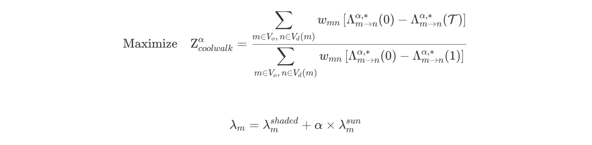

# *Framework* of Optimizing Street Tree Placement for Maximum Shade and Pedestrian Benefit

Author: Frank Chen

Advisor: Prof. Li, Prof. Delmelle

## Introduction

- Extreme heat is one of the leading environmental causes of mortality worldwide.
- Trees mitigate urban heat through shading and evapotranspiration, but the cooling benefit varies dramatically with placement and local land cover.
- Traditional tree planting often uses land suitability or equity mapping but doesn't explicitly target where people are most exposed.
- New spatial data (e.g., LiDAR, anonymized mobility data) enables identification of places where shade and pedestrian flows overlap.
- Balance between environmental return (shaded area) and pedestrian benefit (foot traffic) is crucial for effective urban forestry.

## Literature Review

- Urban vegetation, especially tree canopy shading, significantly reduces urban air and surface temperatures at multiple scales.
- Street trees enhance pedestrian thermal comfort and encourage walking by providing shade and reducing heat stress along sidewalks.
- Tradeoff between maximizing shaded area and ensuring pedestrian accessibility is critical, because high building density can reduce the effectiveness of tree shade in certain urban areas, while pedestrian activity can be more concentrated in these areas.

#### Research Gap
- Existing studies often focus on either environmental benefits or pedestrian accessibility, but not both simultaneously.
- Traditional tree planting strategies often rely on land suitability or equity mapping, without explicitly linking shade provision to human exposure patterns.
- Existing studies do not account for the dynamic nature of pedestrian flows and their interaction with new shaded areas, which can affect pedestrian routing choices after tree planting.

#### Contribution

- Introduces a new spatial optimization model that jointly maximizes both unique new shade area and pedestrian benefit, explicitly tuning the tradeoff between environmental cooling and active mobility.
- Incorporates realistic urban planting constraints, such as spacing rules, infrastructure conflicts, and avoidance of redundant canopy overlap, into the optimization process.
- Use NSGA-II, a metaheuristic algorithm, to solve the multi-objective optimization problem.

## Methodology

#### Objectives

There are two objectives in this optimization problem. `Z_shade` is the objective to maximize the total shaded area provided by the new trees. 

`Z_coolwalk` is the objective to maximize the pedestrian benefit, which is modified based on the "CoolWalkability" index from [this paper](nature.com/articles/s41598-025-97200-2) on Scientific Reports. It measures a city's capability to provide shaded walking routes by quantifying how much pedestrian exposure to sun can be reduced through optimal shade-aware routing compared to the least shaded paths, reflecting how well the urban form supports cool, active mobility. It first computes the experienced path length $\lambda_m$ by amplifying the unshaded length of an edge by a weighting parameter $\alpha$ that represents how much more pedestrians prefer shaded paths over unshaded ones. Then, for a given set of OD pairs, it calculates the shortest path lengths under different shading conditions (fully unshaded, fully shaded, and shaded by the selected trees) to quantify the walking cooling benefit of the new trees.

Subject to:

Where:

- $i, j$ are the potential tree sites
- $S_i$ is the unique shade area of tree site $i$
- $O_{ij}$ is the overlap area between tree sites $i$ and $j$
- $\alpha$ is the weighting parameter for the not shaded length of an edge on the graph
- $N$ is the number of trees to plant
- $\lambda_m$ is the updated length of an edge $m$ after shading
- $\lambda_m^{shaded}$ is the shaded length of an edge $m$
- $\lambda_m^{sun}$ is the unshaded length of an edge $m$
- $V_o$ is the set of origin nodes
- $V_d(m)$ is the set of destination nodes for origin node $m$
- $w_{mn}$ is the traffic weight of the OD pair $(m, n)$
- $\Lambda_{m \rightarrow n}^{\alpha, *}(0)$ is the shortest path length from $m$ to $n$ when edges are fully unshaded (i.e., no shaded length)
- $\Lambda_{m \rightarrow n}^{\alpha, *}(1)$ is the shortest path length from $m$ to $n$ when edges are fully shaded (i.e., all shaded length)
- $\Lambda_{m \rightarrow n}^{\alpha, *}(\mathcal{T})$ is the shortest path length from $m$ to $n$ when edges are shaded by a selected set of new trees $\mathcal{T}$

The equations above can also be found in [opt.ipynb](opt.ipynb).

#### Spatial Optimization Model

- Spatial optimization aims to select the best locations or arrangements of spatial entities (e.g., trees, facilities, sensors) to maximize or balance competing objectives.
- These problems often involve large, combinatorial search spaces and complex spatial interactions (e.g., overlap, proximity, network effects).
- Exact algorithms are usually infeasible for real-world, large-scale spatial problems due to computational complexity.
- Heuristic algorithms (e.g., genetic algorithms, simulated annealing, tabu search) efficiently explore large, complex solution spaces when exact methods are impractical. They provide high-quality, near-optimal solutions in reasonable computation time, making them widely used in spatial and network optimization.
- Advanced metaheuristics like NSGA-II enable multi-objective optimization, producing a set of trade-off solutions (Pareto front) for decision-makers.

#### NSGA-II Algorithm

NSGA-II (Non-dominated Sorting Genetic Algorithm II) is a widely used evolutionary algorithm designed for solving multi-objective optimization problems (MOOPs)

##### Workflow Overview

- Population Initialization: Start with a randomly generated population of potential solutions.
- Evaluation: Each solution is evaluated according to multiple objectives.
- Non-dominated Sorting: The population is sorted into different "fronts" based on Pareto dominance; solutions in the first front are not dominated by any others.
- Crowding Distance Calculation: Within each front, a crowding distance is computed to ensure diversity by estimating how close solutions are to each other.
- Selection: Solutions are selected using a crowded tournament selection operator, which prefers solutions in better fronts and with higher crowding distance.
- Crossover & Mutation: Selected solutions undergo crossover and mutation to generate offspring.
- Elitism: Parents and offspring are combined; the best individuals (based on front ranking and diversity) form the next generation.
- Repeat: The process continues until a stopping criterion (such as a set number of generations) is reached.

##### Why NSGA-II is Suitable for This Task

- Handles Multiple Conflicting Objectives: My task involves optimizing for both Z_shade and Z_coolwalk, which are competing goals—NSGA-II can efficiently find a set of trade-off (Pareto optimal) solutions.

- Combinatorial Decision Space: The problem (selecting a subset of trees) is a combinatorial optimization, a class for which NSGA-II is extensively used and validated.

- Diversity of Solutions: NSGA-II provides a diverse set of optimal solutions, helping in decision-making by illustrating possible trade-offs.

- Benchmark Performance: Studies show NSGA-II outperforms or matches other metaheuristics in similar real-world resource allocation, assignment, and scheduling problems.

## Experiment

#### Shade Computation

I first extract the digital surface model (DSM) using LiDAR data, then mask the pedestrian area dsm using curb lines and land use data. I then exclude the buffer area of utility poles, postboxes, existing trees, street corners, and buildings to avoid conflicts with the new trees. 

I assign the tree species to new tree sites by using their closest existing trees information. After simulation of tree planting using the average height and canopy width of the species, I use GPU to compute the shade for each potetial tree site. By creating a patch for each potential tree site, I can compute:

- S_original: The original shade of the patch using the DSM.
- S_planted: The shade of the patch after planting a tree using `apply_tree_to_dsm()`.
- S_unique: The unique shade of the patch after planting a tree, which is the difference between S_planted and S_original.
- S_unique_on_edge: The unique shade of the patch on the edges of the road network graph, which is the vectorized unique shade that intersects with the road network edge gdf.

By moving two patches using their coordinates, I can compute the overlap between two potential tree sites:

- S_overlap: The overlap shade between two patches, which is the intersection of their unique shades.
- S_overlap_on_edge: The overlap shade on the edges of the road network graph, which is the vectorized overlap shade that intersects with the road network edge gdf.

See [shade.ipynb](shade.ipynb) for details.

#### Coolwalkability Index

I use the ADVAN foot traffic data of July, 2024 (67,000+ records) to create a set of origin-destination (OD) pairs. Here are the steps:

- Create Graph for pedestrian network using data from [DVRPC](https://www.arcgis.com/home/item.html?id=5959ca82848f4833a65cd90ef991c080)
- Load the ADVAN foot traffic data to the nodes in the Graph
- Create OD pairs by running `networkx.single_source_dijkstra_path_length()` on the Graph, and set the "cutoff" parameter to 2640 feet (0.5 miles)
- Compute the weight of each OD pair using the formula, for each OD pair $(i,j)$:

- For each OD pair, I then compute the top 5 shortest paths using the `networkx.shortest_simple_paths()` function, I will use these paths to select the best path after graph update. Because people may not want to choose a fully-shaded long route, so I keep them to choose in a reasonable choice pool. This also saves computer resources.

See [shortest_path.ipynb](shortest_path.ipynb) for details.

#### Optimization

I have run the optimization for three different values of $\alpha$: 1.01, 2.0, and 100.0, which represent different levels of perceptions of the unshaded walking experience. I also tested the optimization with two different tree selection sizes: 500 and 1000. The study area is limited to Center City District, Philadelphia, and sampled the 44,818 OD pairs from 158,652 pairs, due to the capability of the PC.

It took about 6 hours to run the optimization tasks for 6 scenarios in total, when pop_size=30 (larger can produce more accurate results but raise resource cost) and 8 CPU cores in parallel. 

See [opt.ipynb](opt.ipynb) for details.

#### Results
For detailed visualization of the results, please refer to the [vis.ipynb](vis.ipynb) notebook.

## Next Steps

- Increase pop_size and re-run the optimization tasks to get more accurate results.
- Increase N_select because the tradeoff curve is not smooth enough when N_select is small (e.g. 500).
